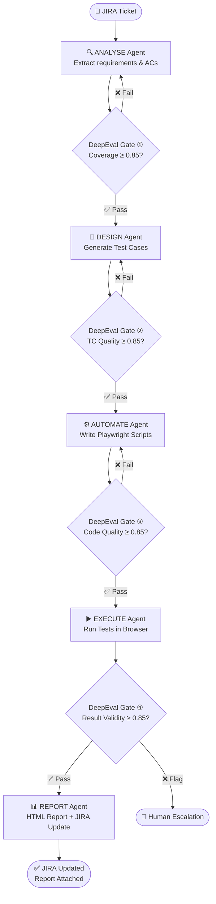

# 🤖 AI-QA-POC — AI-Powered Quality Assurance Platform

> **Proof of Concept** — An orchestrated, multi-agent QA automation pipeline powered by Claude AI, Playwright, and DeepEval. From JIRA ticket to verified HTML report — fully automated.

---

## 📌 What Is This?

This repository is a **Proof of Concept** for a next-generation QA automation system that uses AI agents to perform the entire Software Testing Life Cycle (STLC) — from reading requirements to writing scripts, executing them, and reporting results back to JIRA — **with zero manual scripting per ticket**.

Every ticket goes through a 5-phase pipeline, with a DeepEval quality gate after each phase to prevent low-quality output from advancing.

---

## 🏗️ System Architecture

```
┌─────────────────────────────────────────────────────────────────────┐
│                          JIRA BOARD                                 │
│       Source of tickets · Acceptance criteria · Priority            │
└──────────────────────────────┬──────────────────────────────────────┘
                               │  fetch open / in-progress tickets
                               ▼
┌─────────────────────────────────────────────────────────────────────┐
│                        QA ORCHESTRATOR                              │
│                  (Claude Code Workflow Script)                      │
│                                                                     │
│   ┌──────────┐   ┌──────────┐   ┌──────────┐   ┌──────────┐       │
│   │ ANALYSE  │──►│  DESIGN  │──►│AUTOMATE  │──►│ EXECUTE  │       │
│   │  Agent   │   │  Agent   │   │  Agent   │   │  Agent   │       │
│   └────┬─────┘   └────┬─────┘   └────┬─────┘   └────┬─────┘       │
│        │              │              │              │               │
│        ▼              ▼              ▼              ▼               │
│   ┌──────────┐   ┌──────────┐   ┌──────────┐  ┌──────────┐        │
│   │DeepEval  │   │DeepEval  │   │DeepEval  │  │DeepEval  │        │
│   │ Gate ①  │   │ Gate ②  │   │ Gate ③  │  │ Gate ④  │        │
│   │Coverage  │   │TC Quality│   │Code Qual │  │Results   │        │
│   └────┬─────┘   └────┬─────┘   └────┬─────┘  └────┬─────┘        │
│   ✅pass│        ✅pass│        ✅pass│        ✅pass│              │
│   ❌retry         ❌retry         ❌retry         ❌flag            │
│                                                       │             │
│                                              ┌────────▼───────┐    │
│                                              │  REPORT Agent  │    │
│                                              └────────┬───────┘    │
└───────────────────────────────────────────────────────┼────────────┘
                                                        │
                               ┌────────────────────────┘
                               │  write results · attach report · update status
                               ▼
┌─────────────────────────────────────────────────────────────────────┐
│                          JIRA BOARD                                 │
│         Status updated · HTML report attached · Comments added      │
└─────────────────────────────────────────────────────────────────────┘

                 All agents read from / write to:
┌─────────────────────────────────────────────────────────────────────┐
│                      SHARED MEMORY LAYER                            │
│  app-selectors.md · navigation-map.md · env-quirks.md              │
│  ui-patterns.md · tc-templates.md · deepeval-history.md            │
└─────────────────────────────────────────────────────────────────────┘
```

---

## 🔄 Pipeline Flow



---

## 🧰 Technology Stack

| Layer | Technology | Purpose |
|---|---|---|
| **LLM** | Claude Sonnet 4.6 (via Claude Code) | All 5 agents — one model, one API key |
| **Orchestration** | Claude Code Workflow | Pipeline, parallel & sequential execution |
| **Test Automation** | Playwright + TypeScript | Browser automation & test execution |
| **QA Evaluation** | DeepEval | Quality scoring at each phase gate |
| **Project Management** | JIRA (via MCP) | Source of truth for requirements & status |
| **Memory** | Markdown files (local) | Shared knowledge base — fast, version-controlled |
| **Reporting** | Custom standalone HTML | Per-run dashboards with charts & acceptance criteria |
| **Language** | TypeScript | Type-safe scripts, page objects, helpers |

---

## 📁 Repository Structure

```
AI-QA-POC/
│
├── src/                              ← Shared framework (all projects use this)
│   ├── base/BasePage.ts              ← Base class all page objects extend
│   ├── utils/                        ← Logger, screenshot manager, test data manager
│   ├── helpers/                      ← Assertion, string, wait helpers
│   ├── config/env.config.ts          ← Environment configuration
│   ├── models/                       ← Shared TypeScript interfaces
│   ├── constants/                    ← App-wide constants
│   └── api/health-check.ts           ← API health check utilities
│
├── nopCommerce-Guest-Checkout-E2E/   ← E2E test suite (feature project)
│   ├── requirement/                  ← Source requirement documents
│   ├── scripts/                      ← Playwright spec files
│   │   ├── e2e/                      ← End-to-end flows
│   │   ├── negative/                 ← Negative test scenarios
│   │   └── validation/               ← Boundary & validation tests
│   ├── page-objects/                 ← POM files for this feature
│   ├── test-data/                    ← JSON test data
│   ├── output/                       ← All test results (never outside this folder)
│   │   ├── playwright-report/        ← Playwright HTML reports
│   │   └── reports/                  ← Custom HTML dashboards
│   └── tools/                        ← Suite-specific utility scripts
│
├── BUG-Retest-Insurance-Name-Truncation/   ┐
├── BUG-Retest-Manufacturer-Model-Audit-Fields/ │
├── BUG-Retest-SOS-1329-Auth-Request-Date/  │ Bug retest suites
├── BUG-Retest-SOS-1357-Move-Orders-Search/ │ (each self-contained)
├── BUG-Retest-SOS-CLIENT-LOCATIONS-STATE/  │
├── BUG-Retest-STAR-2173-RA/               ┘
│
├── AI-QA-Client-Proposal/           ← Client proposal documents
├── AI-QA-POC-Presentation.html      ← Interactive POC presentation
├── AI-QA-Management-Report-20260603.html ← Management summary report
├── QA-MULTI-AGENT-ARCHITECTURE.md   ← Full architecture specification
├── CLAUDE.md                        ← AI agent rules & conventions
├── playwright.config.ts             ← Root Playwright configuration
├── package.json                     ← Dependencies & scripts
└── tsconfig.json                    ← TypeScript configuration
```

---

## ✅ Completed Projects

| Project Folder | Ticket / Feature | Test Cases | Result |
|---|---|---|---|
| `nopCommerce-Guest-Checkout-E2E/` | Guest Checkout E2E | Active suite | 🟡 Active |
| `BUG-Retest-Insurance-Name-Truncation/` | Insurance name truncation bug | — | ✅ Fix Verified |
| `BUG-Retest-STAR-2173-RA/` | STAR-2173 RA requirements | 14 TCs | ✅ 14/14 PASS |
| `BUG-Retest-SOS-1357-Move-Orders-Search/` | SOS-1357 Move Orders search boxes | 14 TCs | ✅ 14/14 PASS |
| `BUG-Retest-SOS-1329-Auth-Request-Date/` | SOS-1329 Auth request date field | 10 TCs | ✅ 10/10 PASS |
| `BUG-Retest-SOS-CLIENT-LOCATIONS-STATE/` | Client locations state/territory | 10 TCs | ✅ 10/10 PASS |
| `BUG-Retest-Manufacturer-Model-Audit-Fields/` | Manufacturer/model audit tab | 15 TCs | ✅ 15/15 PASS |

---

## 🤖 Agent Responsibilities

### 1️⃣ ANALYSE Agent
Reads the JIRA ticket and produces a structured requirement document — test scope, AC mapping, pre-conditions, and environment details.

### 2️⃣ DESIGN Agent
Designs test suites (TS-001, TS-002…) and writes individual test cases with TC ID, priority (Critical / High / Medium), steps, and expected results. Every acceptance criterion must map to at least one Critical TC.

### 3️⃣ AUTOMATE Agent
Creates the dedicated project folder, writes Playwright TypeScript spec files, Page Object Model classes (extending `BasePage`), test data files, and `playwright.config.ts` — following CLAUDE.md structure rules.

### 4️⃣ EXECUTE Agent
Runs the Playwright suite against the live application, captures screenshots for every TC, and writes newly discovered selectors/navigation paths to the shared memory layer.

### 5️⃣ REPORT Agent
Generates a standalone custom HTML dashboard, saves it in `output/run-history/{YYYYMMDD-HHMM}/`, updates the JIRA ticket status, attaches the report, and adds an execution summary comment.

---

## 🧠 Shared Memory Layer

The memory layer prevents agents from re-discovering the same selectors, navigation paths, and environment quirks on every run:

```
memory/
├── TIER-1-SHARED-KNOWLEDGE/         ← All agents read before every task
│   ├── app-selectors.md             ← Verified DOM selectors by feature area
│   ├── navigation-map.md            ← Exact URL / menu path per feature
│   ├── env-quirks.md                ← Auth flows, SSO differences per env
│   └── ui-patterns.md               ← Reusable interaction patterns
│
├── TIER-2-OPERATIONAL/              ← Orchestrator & Report Agent read/write
│   ├── deepeval-history.md          ← Gate scores per ticket per run
│   ├── jira-field-map.md            ← JIRA project keys, field IDs
│   └── tc-templates.md              ← Reusable TC patterns per feature type
│
└── TIER-3-INTELLIGENCE/             ← Builds up over time (Sprint 3+)
    ├── selector-library.md          ← Full verified selector catalogue
    ├── agent-performance.md         ← High-scoring prompt patterns
    └── flaky-test-registry.md       ← Tests needing retry or extra waits
```

---

## 🚦 DeepEval Quality Gates

Each gate runs after its agent. **Threshold: 0.85**. On failure, the orchestrator retries with the gap list injected into the prompt. Maximum **3 retries** before human escalation.

| Gate | After Agent | Key Metrics |
|---|---|---|
| **Gate ①** | ANALYSE | AC Coverage (40%), Completeness (30%), Ambiguity (20%), Scope (10%) |
| **Gate ②** | DESIGN | Traceability (35%), Assertion Depth (25%), Priority Alignment (20%), Boundary Coverage (20%) |
| **Gate ③** | AUTOMATE | TC Coverage (30%), Selector Quality (30%), POM Compliance (25%), Assertions (15%) |
| **Gate ④** | EXECUTE | Execution Completeness (30%), Bug Evidence (30%), False Positive Guard (25%), Observations (15%) |

---

## ⚙️ Project Folder Convention

Every test suite lives in its own dedicated folder with a mandatory structure:

```
{ProjectName}/
├── README.md                 ← Navigation guide + run command
├── requirement/              ← Source requirement docs
├── scripts/                  ← Playwright spec files
├── page-objects/             ← Page Object Model files
├── test-data/                ← JSON test data
├── config/                   ← Playwright config for this suite
└── output/
    ├── run-history/          ← One timestamped folder per execution
    ├── playwright-report/    ← Playwright HTML reports
    └── artifacts/            ← Screenshots, videos, traces
```

**Naming conventions:**

| Type | Format | Example |
|---|---|---|
| Feature test | `{Name}-E2E` | `nopCommerce-Guest-Checkout-E2E` |
| Bug retest | `BUG-Retest-{Feature}` | `BUG-Retest-Insurance-Name-Truncation` |
| Feature suite | `{Feature}-Tests` | `PaymentGateway-Tests` |

---

## 🚀 Quick Start

### Prerequisites

```bash
node >= 18
npm >= 9
```

### Install Dependencies

```bash
npm install
npx playwright install --with-deps
```

### Configure Environment

```bash
cp .env.example .env
# Edit .env with your credentials and target URL
```

### Run a Test Suite

```bash
# Run all tests
npx playwright test

# Run specific project (headed browser)
npx playwright test --project=chromium --headed

# Run a specific folder
npx playwright test nopCommerce-Guest-Checkout-E2E/scripts/

# View report
npm run report
```

### Available Scripts

| Script | Command | Description |
|---|---|---|
| All tests | `npm test` | Run all Playwright tests |
| Headed | `npm run test:headed` | Run tests with visible browser |
| Chromium only | `npm run test:chromium` | Chromium browser only |
| Firefox only | `npm run test:firefox` | Firefox browser only |
| Debug mode | `npm run test:debug` | Step-through debugging |
| View report | `npm run report` | Open last Playwright report |

---

## 📊 HTML Report Format

Every execution produces a **custom standalone HTML dashboard** (not the raw Playwright index.html) with:

- ✅ Result banner (green/amber) with pass/fail summary
- 📊 SVG donut chart (pass %) + per-suite progress bars
- 📋 Test results table with TC ID, description, priority, badge, timestamps
- 📝 Acceptance criteria table — criterion → test coverage → MET / NOT MET
- 🌐 Environment card (URL, browser, Playwright version, run ID)
- 🔗 Links to previous runs and iteration comparison

Reports are stored at:
```
{ProjectFolder}/output/run-history/{YYYYMMDD-HHMM}/{suite-name}-{YYYYMMDD}-{HHMM}.html
```

---

## 📈 Scalability

| Dimension | Today | Future |
|---|---|---|
| **Ticket volume** | 3–5 tickets/sprint | 50+ (same code, queued) |
| **Environments** | 1 (dev.dmerocket.com) | Multiple (pass baseURL as arg) |
| **Team size** | Solo QA | CI/CD via JIRA webhook trigger |

---

## 📄 Key Documents

| Document | Description |
|---|---|
| [`CLAUDE.md`](./CLAUDE.md) | AI agent rules — folder structure, naming, report format |
| [`QA-MULTI-AGENT-ARCHITECTURE.md`](./QA-MULTI-AGENT-ARCHITECTURE.md) | Full multi-agent architecture specification |
| [`AI-QA-POC-Presentation.html`](./AI-QA-POC-Presentation.html) | Interactive POC presentation |
| [`AI-QA-Management-Report-20260603.html`](./AI-QA-Management-Report-20260603.html) | Management-level summary report |

---

## 📝 License

ISC — See [package.json](./package.json) for details.

---

*Built with Claude Sonnet 4.6 · Playwright · TypeScript · DeepEval*